# 🏛 CasaStudente Architecture

> System architecture overview for the CasaStudente student housing platform.

---

## Table of Contents

- [High-Level Architecture](#high-level-architecture)
- [Application Layers](#application-layers)
- [Data Model](#data-model)
- [Authentication Flow](#authentication-flow)
- [Payment Flow](#payment-flow)
- [AI Pipeline](#ai-pipeline)
- [Notification System](#notification-system)
- [Data Access Strategy](#data-access-strategy)
- [Security Architecture](#security-architecture)
- [External Integrations](#external-integrations)
- [Deployment Architecture](#deployment-architecture)

---

## High-Level Architecture

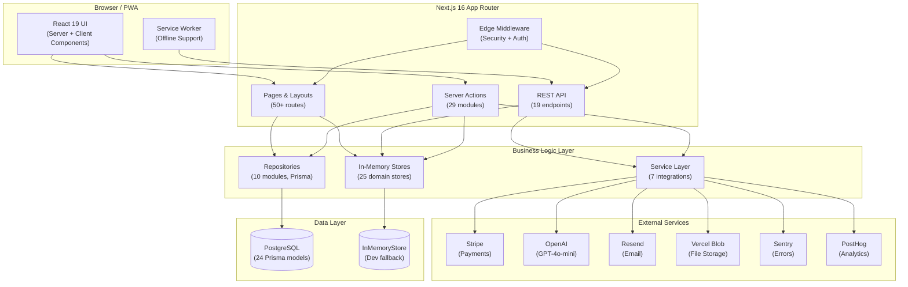

---

## Application Layers

The codebase follows a **layered architecture** with clear separation of concerns:

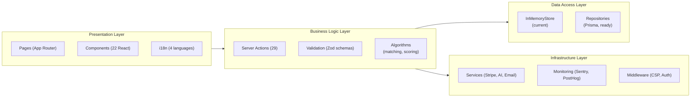

### Layer Details

| Layer | Location | Responsibility |
|---|---|---|
| **Presentation** | `src/app/`, `src/components/` | Pages, layouts, UI components, i18n |
| **Business Logic** | `src/lib/actions/`, `src/lib/validation.ts` | Server Actions, input validation, business rules |
| **Data Access** | `src/lib/stores/`, `src/lib/repositories/` | Domain stores, Prisma repositories |
| **Infrastructure** | `src/lib/services/`, `src/middleware.ts` | External service integrations, security |

---

## Data Model

### Core Entity Relationships

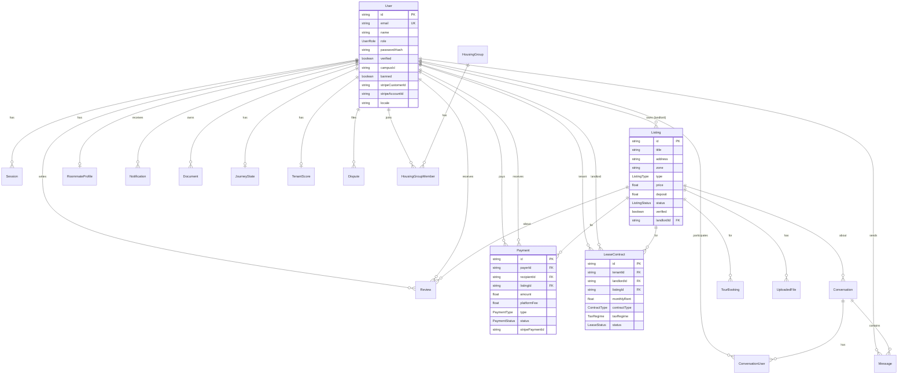

### Models Summary (24 total)

| Domain | Models |
|---|---|
| **Auth** | `User`, `Session` |
| **Listings** | `Listing` |
| **Messaging** | `Conversation`, `ConversationUser`, `Message` |
| **Roommates** | `RoommateProfile` |
| **Reviews** | `Review` |
| **Payments** | `Payment`, `LeaseContract` |
| **Notifications** | `Notification`, `SavedSearch` |
| **Documents** | `Document`, `UploadedFile` |
| **Journey** | `JourneyState`, `OnboardingProgress` |
| **Community** | `CommunityPost` |
| **Trust** | `TenantScore` |
| **Insurance** | `InsurancePolicy` |
| **Disputes** | `Dispute` |
| **Groups** | `HousingGroup`, `HousingGroupMember` |
| **Analytics** | `TelemetryEvent` |
| **Tours** | `TourBooking` |

---

## Authentication Flow

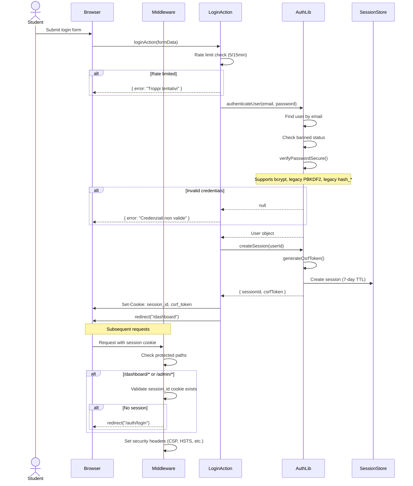

### Password Security

```
New Registration → bcrypt (cost 12)
Login Verification → Supports 3 formats:
  ├── $2a$/$2b$ → bcrypt.compare()
  ├── pbkdf2$*  → HMAC-SHA512 (legacy)
  └── hash_*    → Simple hash (demo seed data only)
```

---

## Payment Flow

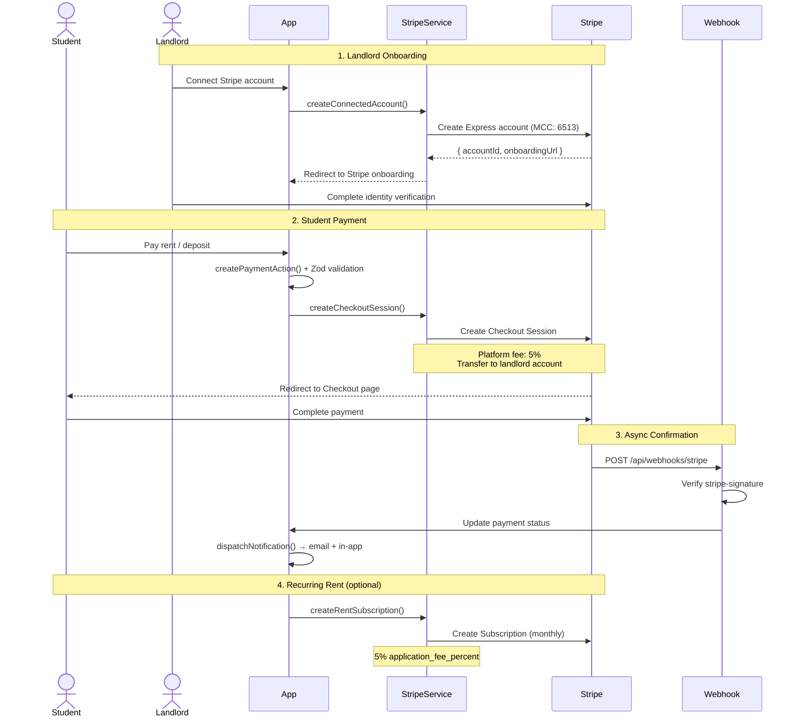

### Payment Types

| Type | Description | Stripe Mode |
|---|---|---|
| `rent` | Monthly rent payment | `payment` (one-time) or `subscription` |
| `deposit` | Security deposit | `payment` (one-time) |
| `deposit_return` | Deposit refund | `refund` |
| `insurance_premium` | Insurance premium | `payment` (one-time) |

---

## AI Pipeline

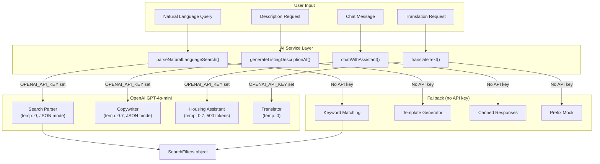

### Rate Limits

AI actions are rate-limited to **50 requests per 24 hours** per user to control API costs.

---

## Notification System

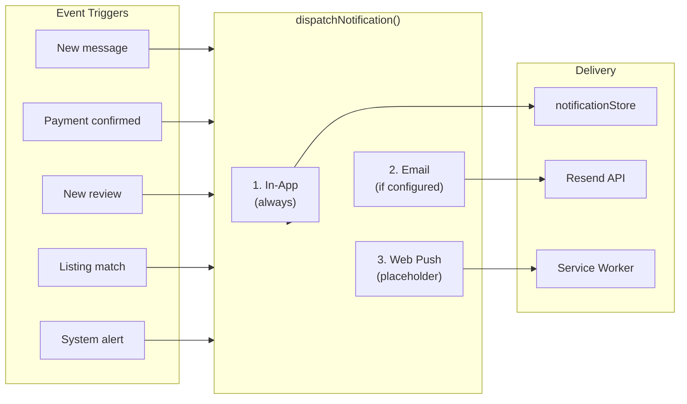

### Email-Worthy Types (auto-send)

Payments, messages, reviews, and system notifications trigger email by default. Listing match notifications only trigger in-app alerts unless the user has saved search email preferences enabled.

---

## Data Access Strategy

The app uses a **dual-mode data access pattern** to support both development (no database) and production (PostgreSQL):

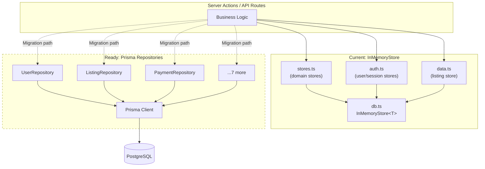

### InMemoryStore API

```typescript
class InMemoryStore<T extends { id: string }> {
  findAll(): Promise<T[]>
  findById(id: string): Promise<T | undefined>
  create(item: T): Promise<T>
  update(id: string, updates: Partial<T>): Promise<T | undefined>
  delete(id: string): Promise<boolean>
  filter(predicate: (item: T) => boolean): Promise<T[]>
  count(): Promise<number>
  seed(items: T[]): void
}
```

---

## Security Architecture

### Middleware Pipeline

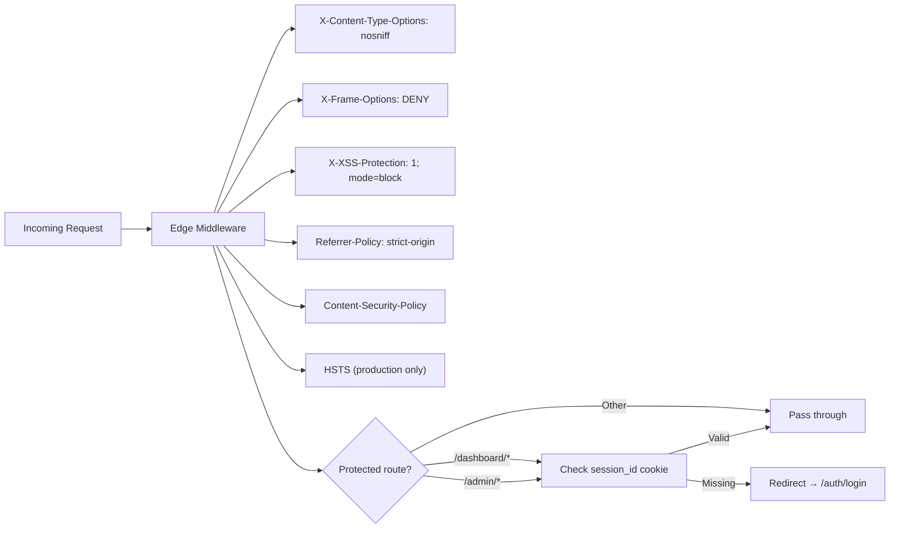

### Security Features

| Feature | Implementation |
|---|---|
| **Password Hashing** | bcrypt (cost 12) |
| **CSRF Protection** | `crypto.randomBytes(32)` + `timingSafeEqual` |
| **Input Validation** | Zod schemas on all server actions |
| **XSS Prevention** | HTML stripping on all text inputs |
| **Rate Limiting** | In-memory sliding window |
| **CSP** | Strict Content-Security-Policy header |
| **HSTS** | Enabled in production (1 year, preload) |
| **Cookie Security** | HttpOnly, Secure, SameSite |
| **Webhook Verification** | Stripe signature validation |
| **Error Sanitization** | Sentry strips cookies and auth headers |

---

## External Integrations

All external services are **optional** with graceful fallbacks:

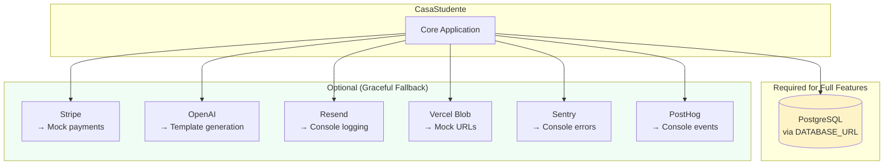

### Service Configuration Check

```typescript
// Available at runtime via /api/health
{
  stripe: isStripeConfigured(),       // !!STRIPE_SECRET_KEY
  email: isEmailConfigured(),         // !!RESEND_API_KEY
  blob: isBlobConfigured(),           // !!BLOB_READ_WRITE_TOKEN
  ai: isAIConfigured(),              // !!OPENAI_API_KEY
  monitoring: isMonitoringConfigured() // !!SENTRY_DSN || !!POSTHOG_API_KEY
}
```

---

## Deployment Architecture

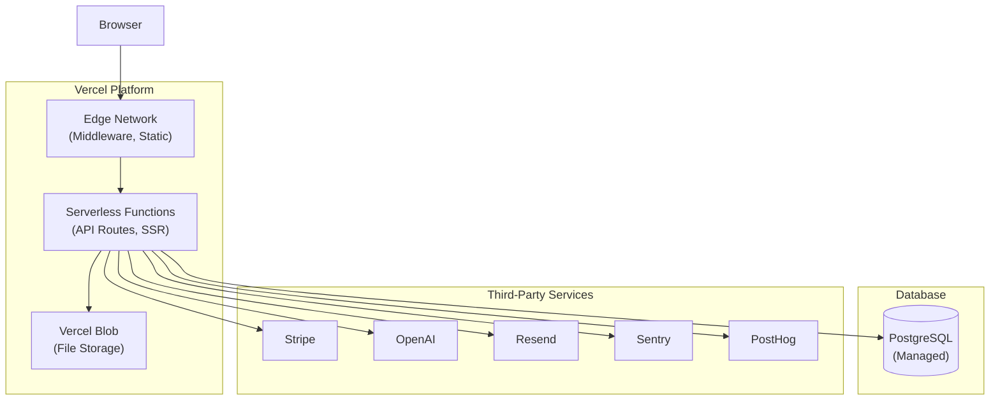

### Build & Deploy

```bash
# Local development
npm run dev          # Next.js dev server on :3000

# Production build
npm run build        # Outputs to .next/

# Deploy
npx vercel           # Deploy to Vercel
```

### Environment-Specific Behavior

| Feature | Development | Production |
|---|---|---|
| Data store | InMemoryStore (seeded) | PostgreSQL (Prisma) |
| Logging | Human-readable with emoji | Structured JSON |
| HSTS | Disabled | Enabled (1 year) |
| Sentry sampling | 100% | 10% |
| Telemetry | Console buffered | PostHog batched |
| Passwords | bcrypt (same) | bcrypt (same) |
