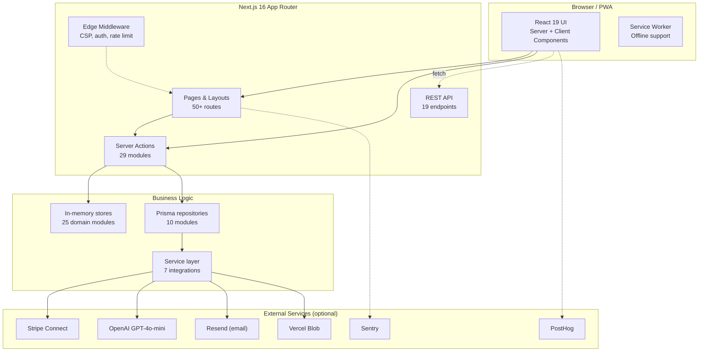
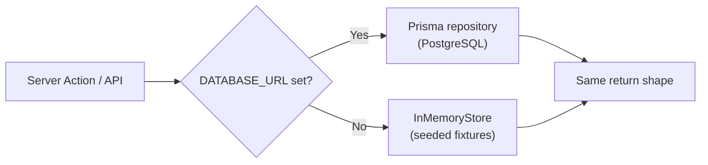
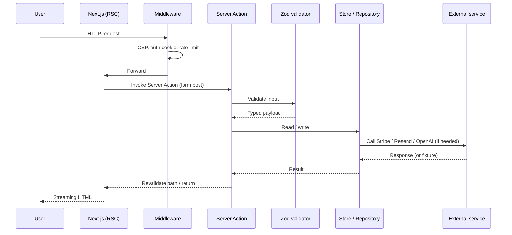

# Architecture

CasaStudente is a **Next.js 16 App Router** application with a layered backend: pages and Server Actions on top, an application layer of stores and repositories in the middle, and external services (Stripe, OpenAI, Resend, Vercel Blob) at the edges. Every external service has a graceful local fallback, so the whole platform runs on a laptop with zero credentials.

## High-level view

## Application layers

| Layer | Lives in | Responsibility |
| ----- | -------- | -------------- |
| **UI** | `src/app/**`, `src/components/**` | React Server Components for data fetching, Client Components for interactivity. |
| **Edge middleware** | `src/middleware.ts` | Security headers (CSP, HSTS), route protection, locale negotiation, rate limiting. |
| **Server Actions** | `src/lib/actions/**` (29 modules) | The primary mutation API. Called from forms and `useActionState`. |
| **REST API** | `src/app/api/**` (19 endpoints) | Public reads, webhooks, file upload, institutional data, third-party callbacks. |
| **Stores & Repositories** | `src/lib/stores/**`, `src/lib/repositories/**` | Stores wrap a typed in-memory CRUD base class. Repositories wrap Prisma. Both expose the same shape, so business logic doesn't know which is active. |
| **Service layer** | `src/lib/services/**` | Adapters for Stripe, OpenAI, Resend, Vercel Blob, Sentry, PostHog. Every adapter detects missing credentials and returns a no-op or fixture. |

## Data access strategy

The platform deliberately supports two coexisting storage backends:

- **Seeded in-memory stores** make first-run, demos and tests instantaneous.
- **Prisma + Postgres** kicks in when `DATABASE_URL` is set, with no code changes.
- Both implementations conform to the same TypeScript interfaces (`src/lib/db.ts` defines the `InMemoryStore` base).

This is the same pattern used by the test suite (`tests/unit/stores.test.ts`) to exercise every domain module without spinning up a database.

## Request lifecycle

## Security architecture

- **Auth**: cookie-based sessions (`HttpOnly`, `Secure`, `SameSite=Lax`) backed by bcrypt (cost 12) password hashing. Legacy password migration is built in (`src/lib/password.ts`).
- **CSRF**: per-session double-submit tokens validated on every Server Action.
- **Rate limiting**: in-memory token bucket (`src/lib/rate-limit.ts`) with per-route windows.
- **Validation**: every input goes through Zod schemas in `src/lib/validation.ts`.
- **CSP & headers**: applied at the edge in `middleware.ts`.
- **Role-based access**: `student | landlord | admin` enforced in actions and layouts.
- **University verification**: optional document upload, manual approval, plus email-domain heuristics (`@studio.unibo.it`).

## Where to go next

- 🗃️ **[Data Model](./data-model)** — the 24-model Prisma schema, visualized.
- 🔐 **[Auth & Trust](./auth-and-trust)** — how identity, verification and trust scores work.
- 🔎 **[Listings & Search](./listings-and-search)** — how discovery is built.
- 💬 **[Messaging](./messaging)** — conversation threads and translation.
- 💳 **[Payments](./payments)** — Stripe Connect end-to-end.
