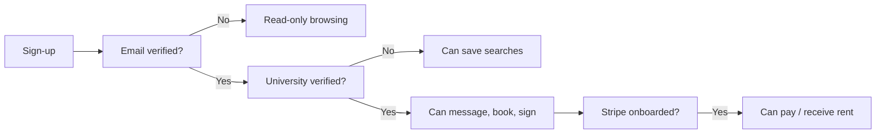

# Auth & Trust

A student housing marketplace lives or dies on trust. CasaStudente layers three independent signals — **identity**, **verification** and **behaviour** — into a single Trust Tier displayed across the product.

## Identity: how accounts are protected

| Concern | Implementation |
| ------- | -------------- |
| Password hashing | `bcryptjs` cost 12, with automatic re-hash on login when a legacy hash is detected (`src/lib/password.ts`). |
| Sessions | Opaque, server-side, stored on the `Session` model. Cookie is `HttpOnly`, `Secure`, `SameSite=Lax`. |
| CSRF | Double-submit token. Generated per session, included in every Server Action form, validated server-side. |
| Rate limiting | In-memory token bucket on login, register, password reset, message send, payment intent. |
| Headers | CSP, HSTS, X-Frame-Options, Referrer-Policy applied in `src/middleware.ts`. |
| Account lockout | Soft lock after repeated failed logins; logged to telemetry. |

## Verification: who can do what

Three independent gates:

- **Email verification** is enforced via a one-time link emailed by Resend (or printed to console in dev).
- **University verification** accepts either an `@studio.unibo.it` (or partner) email **or** a manually-reviewed document upload. Landlords are verified by ID document.
- **Stripe onboarding** uses Stripe Connect Express. Students need a customer ID; landlords need an active Connect account before they can receive payouts.

## Trust scoring

Each user carries a single **Trust Tier**: `bronze`, `silver`, or `gold`. It is derived from:

- Verified identity (email + university)
- Number of completed leases
- 5-dimension review average (cleanliness, communication, accuracy, location, value)
- Payment punctuality (computed in `TenantScore`)
- Account age and dispute history

Tier rules live in `src/lib/services/trust.ts` and are exercised by `features.test.ts`. Tiers are recomputed asynchronously after every relevant event (lease finish, review, payment).

:::tip
Trust is a **signal**, not a paywall. Bronze users can do everything silver users can — but tier is shown on profiles and listings, and search ranking favours higher tiers. This nudges good behaviour without locking anyone out.
:::

## Reviews

- Reviews are **bidirectional**: students review landlords and properties; landlords review tenants.
- A review is only **verified** if there is a `LeaseContract` between reviewer and reviewee with `status in ('active','completed')`.
- Reviews are rate-limited (one per lease per direction) and editable for 14 days.
- Aggregate scores are precomputed on write and stored on `User.trust*` fields for cheap reads.

## Role-based access

The `User.role` enum is enforced at three points:

1. **Layouts**: dashboard routes redirect on role mismatch.
2. **Server Actions**: every action calls `requireRole('student' | 'landlord' | 'admin')` before touching state.
3. **API routes**: REST endpoints under `/api/landlord/**` and `/api/moonshots/**` validate role from the session cookie.

## Where the code lives

| Concern | File |
| ------- | ---- |
| Password & CSRF | `src/lib/password.ts` |
| Session handling | `src/lib/auth.ts` |
| Middleware | `src/middleware.ts` |
| Rate limiter | `src/lib/rate-limit.ts` |
| Validation schemas | `src/lib/validation.ts` |
| Trust scoring | `src/lib/services/trust.ts` |

Tests covering this surface: `password.test.ts`, `rate-limit.test.ts`, `validation.test.ts`, `features.test.ts`.
