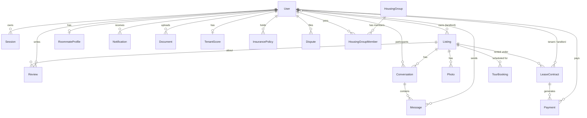

# Data Model

CasaStudente persists state in **24 Prisma models** grouped into seven domains. Every model has a corresponding in-memory store fixture so the app runs without a database. The full schema lives in [`prisma/schema.prisma`](https://github.com/ForliLabs/casa-studente/blob/main/prisma/schema.prisma).

## Domain map



## Domain groups

### 1. Auth & Users
`User`, `Session` — bcrypt passwords, CSRF tokens, role (`student | landlord | admin`), Stripe Customer & Connect Account IDs, locale, ban state, university verification fields.

### 2. Listings
`Listing`, `Photo`, `SavedSearch` — property metadata, photos, zone, all-inclusive pricing, status, verification flag, indexed by zone and price.

### 3. Roommates & Community
`RoommateProfile`, `HousingGroup`, `HousingGroupMember`, `CommunityPost` — compatibility inputs (budget, sleep, cleanliness, social, language), community board posts and housing groups.

### 4. Messaging
`Conversation`, `ConversationUser`, `Message` — listing-scoped threads with unread counts, AI-translated bodies and read receipts.

### 5. Payments & Leases
`Payment`, `LeaseContract`, `TenantScore`, `InsurancePolicy` — Stripe-backed payment records, lease lifecycle (transitorio / 4+4 / 3+2), tax regime (`cedolare secca`), tenant scoring inputs, optional insurance policies.

### 6. Trust & Disputes
`Review`, `Dispute` — 5-dimension reviews, bidirectional, plus a dispute pipeline for the admin team.

### 7. Operations
`Notification`, `Document`, `TelemetryEvent`, `TourBooking`, `UploadedFile`, `JourneyState`, `OnboardingProgress` — everything ops needs to run the platform.

## Key invariants

- A `User` with `role = landlord` may own many `Listing`s; students cannot.
- A `Conversation` is always **scoped to a single listing** — there is no cross-listing DM.
- A `Payment` always references either a `LeaseContract` or a Stripe checkout session; it never floats free.
- A `Review` requires a finished or verified `LeaseContract` between the reviewer and reviewee — this is what powers the **verified** badge.
- `TenantScore` is computed, never user-editable; it’s a function of payment punctuality, lease completions and dispute outcomes.

## Inspecting the data

```bash
# Open Prisma Studio for a visual browser
npm run db:studio
```

For programmatic access, import the generated client:

```ts
import { PrismaClient } from '@/generated/prisma';

const prisma = new PrismaClient();

const verifiedNearCampus = await prisma.listing.findMany({
  where: { verified: true, zone: 'Campus', price: { lte: 400 } },
  orderBy: { price: 'asc' },
  take: 10,
});
```

## Migrations

| Workflow | Command |
| -------- | ------- |
| Iterate quickly (no migration history) | `npm run db:push` |
| Create a versioned migration | `npm run db:migrate` |
| Apply pending migrations (CI / prod) | `npx prisma migrate deploy` |
| Seed demo data | `npm run db:seed` |

See **[Configuration → Scripts](../config/scripts)** for the full script reference.
