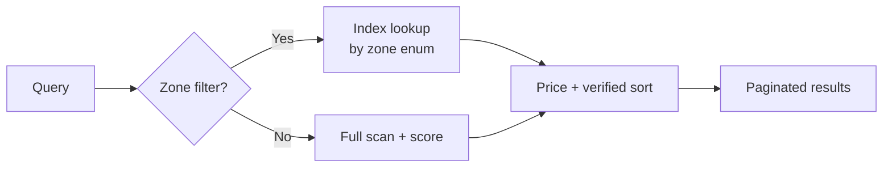

# Listings & Search

A listing is the atomic unit of inventory. It describes one rentable unit — a room, studio or whole apartment — with all-inclusive pricing, photos, location and policies.

## The listing object

```ts
interface Listing {
  id: string;
  title: string;
  address: string;
  zone: 'Campus' | 'Centro' | 'San Martino' | 'Cava' | 'Romiti' | 'Ronco';
  type: 'stanza singola' | 'stanza doppia' | 'monolocale' | 'bilocale' | 'appartamento';
  price: number;        // all-inclusive monthly EUR
  deposit: number;
  status: 'Disponibile' | 'In trattativa' | 'Occupata';
  verified: boolean;
  photos: string[];     // Vercel Blob URLs (or mocked placeholders)
  features: string[];   // amenities (Wi-Fi, lift, balcony, etc.)
  landlord: { id: string; name: string; trust: 'bronze' | 'silver' | 'gold' };
  availableFrom: string; // ISO date
}
```

The full Prisma model adds geolocation (lat/lng), language hints, energy class, EPC certificate, condominium fees breakdown, and a relation to the verifying admin.

## Zones, not coordinates

Forlì has a manageable number of student-relevant zones, so we model **zone** as a first-class field. This makes URLs (`/listings?zone=Campus`), filters and SEO copy clean. Latitude/longitude is still stored for map view and distance queries.



## Search

Three search modes coexist:

### 1. Faceted filters (always on)

`/listings?zone=Campus&priceMax=400&type=stanza singola&verified=1` — handled by `GET /api/listings` with query-param parsing. Stable, indexable, SEO-friendly.

### 2. Saved searches

A logged-in student can save the current filter set; the platform emails a Resend digest whenever new listings match. Stored on the `SavedSearch` model; delivery cadence is per-user.

### 3. Natural-language search (AI)

For users who type "singola luminosa entro 400€ vicino al Campus", the **AI service** (`src/lib/services/ai.ts`) parses the query into a `ListingFilter`:

```ts
const filter = await parseSearchQuery(
  'singola luminosa entro 400€ vicino al Campus',
  { locale: 'it' }
);
// → { type: 'stanza singola', priceMax: 400, zone: 'Campus', features: ['luminoso'] }
```

When `OPENAI_API_KEY` is not set, a deterministic template fallback runs instead — see [Guides → AI features](../guides/ai-features). Tests in `ai-service.test.ts` cover both paths.

## Ranking

Results are sorted by:

1. `verified` first
2. Landlord trust tier (gold > silver > bronze)
3. Price ascending
4. Recency

This is configurable per-query (`?sort=newest|price-asc|price-desc`).

## Verifying a listing

A listing is `verified: true` only when an admin (or moderator) has:

1. Confirmed the landlord owns the property (ID document on file).
2. Reviewed photos for authenticity (or completed a video walkthrough).
3. Validated the address and zone.

The moderation queue lives at `/admin/moderation` and is backed by `verifyListingAction` in `src/lib/actions/admin.ts`.

## Discovery endpoints

| Endpoint | Use |
| -------- | --- |
| `GET /api/listings` | Public catalogue, supports filters. |
| `GET /api/listings/[id]` | Public detail page. |
| `GET /api/institutional/average-rents?zone=Campus` | Open aggregate data — no auth. |
| `GET /api/institutional/vacancy-rates` | Open aggregate data — no auth. |
| `GET /api/institutional/demand-forecast` | Open aggregate data — no auth. |

See [API → REST](../api/rest) for full payloads.
