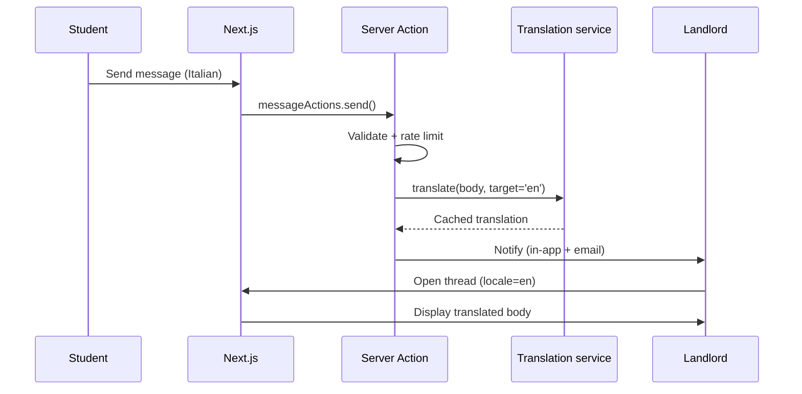

# Messaging

CasaStudente conversations are **listing-scoped**: a single thread groups all communication between a student and a landlord about one property. This keeps inquiries searchable, supports clean unread counts and gives moderators a clear context if a dispute opens.

## Model

```ts
type Conversation = {
  id: string;
  listingId: string;
  participants: User[];     // exactly 2 today; designed to grow for housing groups
  lastMessageAt: Date;
  unreadByUserId: Record<string, number>;
};

type Message = {
  id: string;
  conversationId: string;
  senderId: string;
  body: string;
  bodyTranslated?: Record<string, string>; // cached translations per locale
  createdAt: Date;
  readAt?: Date;
};
```

## Lifecycle



## Auto-translation

When sender and receiver have different `User.locale`s, the AI service translates the body and caches it on the message. The original is always preserved and shown via a "View original" toggle. If `OPENAI_API_KEY` is absent, translation is skipped and the original body is shown with a small notice.

## Unread counts and notifications

- `Conversation.unreadByUserId` is incremented on send and decremented on read.
- A new message produces an in-app `Notification` and, if the recipient has email-notifications on, a Resend email digest.
- Real-time delivery uses Server-Sent Events on dashboard pages; non-dashboard pages poll on focus.

## Anti-spam controls

- Rate limit: 20 messages per conversation per hour, 100 per user per hour.
- New users (account age &lt; 24h) cannot DM more than 3 unique landlords until email-verified.
- Outbound links are stripped from the first 5 messages from a new user.
- The admin **moderation queue** auto-surfaces threads with sudden volume spikes.

## Translation cache

Translations live on the message itself, not on a separate table. This keeps reads cheap (no join) and lets us redact a single row to scrub both original and translations. Cache key: `bodyTranslated[locale]`.
