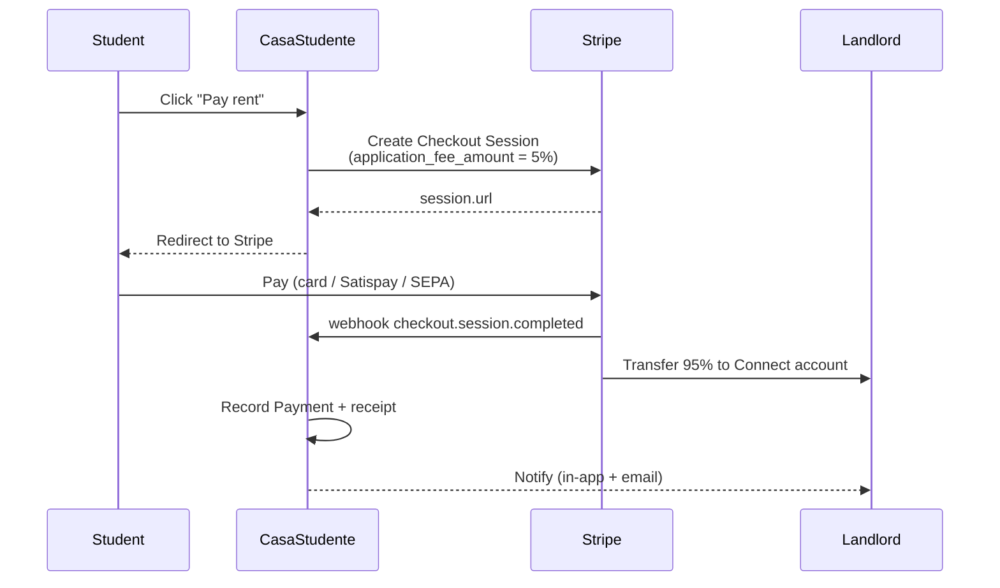

# Payments

CasaStudente is a marketplace: students pay rent, landlords receive payouts, and the platform takes a fee. We use **Stripe Connect Express** for this, because it’s the only setup in Italy that ticks all four boxes: KYC, SCA, payouts to Italian IBANs and PagoPA-compatible receipts.

## Money flow

## Components

| Piece | Where | Notes |
| ----- | ----- | ----- |
| Connect onboarding | `src/lib/actions/landlord.ts` | Creates Express account, returns onboarding URL. |
| Checkout sessions | `src/lib/services/stripe.ts` | One-time and subscription modes. |
| Webhooks | `src/app/api/webhooks/stripe/route.ts` | Verifies signature; updates `Payment` and `LeaseContract`. |
| Refunds | `src/lib/actions/payments.ts` | Issued via Stripe API; mirrored locally. |
| Mock mode | _automatic_ | When `STRIPE_SECRET_KEY` is empty, all calls return deterministic fixtures. |

## Platform fee

The platform fee is configurable via `STRIPE_PLATFORM_FEE_PERCENT` (default `5`). The fee is applied as Stripe’s `application_fee_amount` so it appears as a separate line on the landlord’s payout statement.

## Payment types

- **Deposit** — one-time payment held until lease end. Can be partially or fully refunded via the dispute flow.
- **Rent** — recurring monthly subscription. First month is collected on lease start; subsequent months auto-charge.
- **Service fee (students)** — 5% of first month's rent, one-time, on lease activation.
- **Rent guarantee premium (landlords)** — optional add-on that fronts the rent if the tenant defaults.

## Webhooks

Stripe webhooks update local state:

| Event | Effect |
| ----- | ------ |
| `checkout.session.completed` | Mark `Payment.status = 'paid'`, advance lease state. |
| `invoice.paid` | Append a rent-paid record; bump tenant punctuality score. |
| `invoice.payment_failed` | Notify both parties, surface in admin dashboard. |
| `charge.refunded` | Mirror the refund locally, update dispute. |
| `account.updated` | Refresh landlord onboarding status. |

See [API → Webhooks](../api/webhooks) for the full handler contract.

## Receipts and tax

Every successful payment generates a receipt that is:

- Emailed to both parties (Resend template).
- Stored as a `Document` in the user's document vault.
- Tagged with the lease’s tax regime (`cedolare secca` etc.) for end-of-year exports.

## Mock mode for local dev

If `STRIPE_SECRET_KEY` is unset:

- `createCheckoutSession()` returns a deterministic URL like `/dashboard/payments/mock?id=cs_test_*`.
- The mock page emulates a `checkout.session.completed` webhook so you can walk the full lease-activation flow without Stripe keys.
- `account.updated` for landlords completes immediately.

This is what powers the demo accounts; see **[Stripe Payments guide](../guides/stripe-payments)** for how to switch to real keys.
