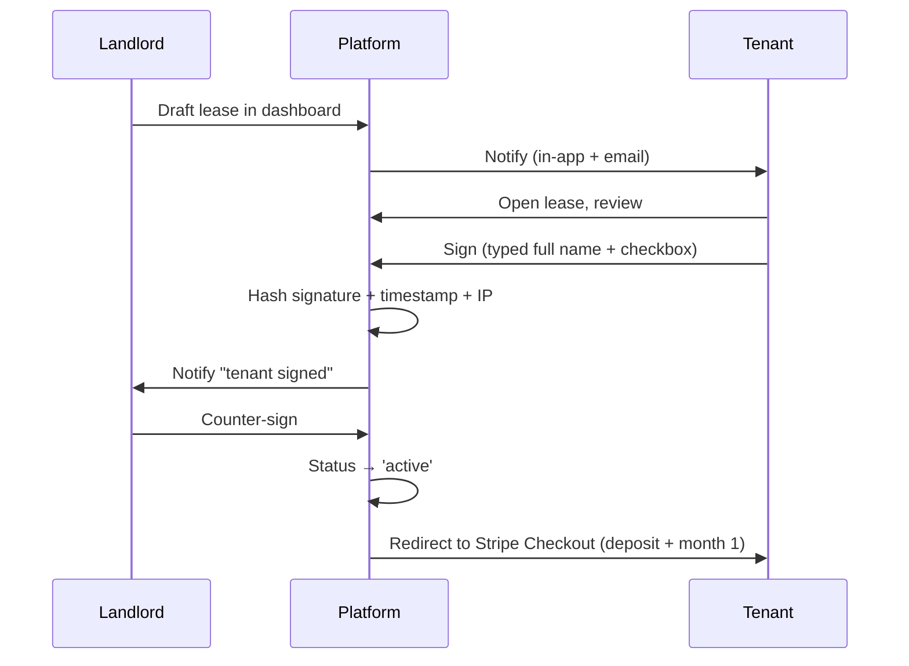

# Leases & Documents

CasaStudente generates, signs and stores rental contracts compliant with Italian law. Every lease lives on the `LeaseContract` model and links to all payments, reviews and disputes that derive from it.

## Lease types

| Type | Duration | Use case | Tax regime |
| ---- | -------- | -------- | ---------- |
| **`transitorio`** | 1–18 months | The default for students. Requires a justification (student status counts). | Compatible with `cedolare secca`. |
| **`4+4`** | 4 years, auto-renewing for 4 more | Long-term tenants. | Compatible with `cedolare secca`. |
| **`3+2`** | 3 years + 2 years renewal, rent capped | "Canone concordato" — favourable tax treatment. | `cedolare secca` at the lower rate. |

All three templates are generated from the same engine in `src/lib/services/lease.ts`, with type-specific clauses injected.

## Generating a lease

```ts
import { generateLeaseContract } from '@/lib/services/lease';

const lease = await generateLeaseContract({
  listingId: 'via-colombo-21-singola',
  tenantId: 'user_martina',
  landlordId: 'user_elena',
  type: 'transitorio',
  startDate: '2026-09-01',
  endDate: '2027-07-31',
  monthlyRent: 380,
  deposit: 760,
  taxRegime: 'cedolare_secca',
  includedUtilities: ['water', 'wifi', 'condominium'],
});
```

The generator:

1. Loads tenant and landlord identity data (verified via the trust system).
2. Validates against Italian rental law (duration caps, deposit ≤ 3× rent, required clauses).
3. Renders a PDF and stores it in the document vault.
4. Stamps a `LeaseContract` row in `pending` state.

## Signing flow



Signatures are stored as `(hash, timestamp, ip)` triples on the `LeaseContract`. Italian law accepts this as a valid electronic signature for residential rentals; for stronger legal weight you can integrate SPID-based signing later.

## Document vault

Every PDF the platform generates (lease, receipt, invoice, document upload) lands in `/dashboard/documents`:

- Filtered by type, date and counterparty.
- Downloadable by both parties involved.
- Permanently linked to the originating `LeaseContract` for audit.
- Storage backend: Vercel Blob in production, mock paths in dev.

## Termination and renewal

- **Transitorio**: ends automatically at `endDate`. Renewal is a brand new lease.
- **4+4**: tenant must give written notice ≥ 6 months before the renewal date.
- **3+2**: same as 4+4 but with 6-month minimum notice on the 2-year renewal.

Early termination opens a dispute. See [Concepts → Auth & Trust](../concepts/auth-and-trust) for the dispute pipeline.

## Tax exports

Landlords can export their year-to-date income in CSV from `/dashboard/landlord/tax`. Columns include:

- Lease ID, tenant name, codice fiscale
- Monthly rent, paid months
- Deposit collected / returned
- Tax regime
- Platform fees paid (deductible)

Designed to paste straight into your commercialista's spreadsheet.
